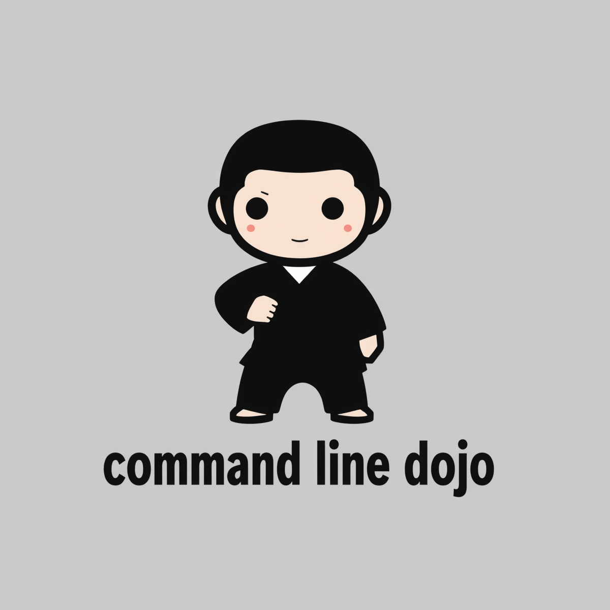

# 🥋 GitHub Actions Dojo

A self-contained sandbox for learning GitHub Actions from the ground up — no GitHub account needed, no pushes required. All workflows run locally via [`act`](https://github.com/nektos/act) inside a devcontainer.

Work through eight belts, each introducing a new concept. A CLI tool tracks your progress and checks your work.

---

## Getting started

**Prerequisites:** Docker Desktop, VS Code with the Dev Containers extension, a GitHub Personal Access Token (classic, `repo` scope).

```bash
git clone <this-repo-url> actions-dojo
cd actions-dojo
cp .env.example .env       # add your GITHUB_TOKEN
code .                     # reopen in container when prompted
```

The devcontainer builds automatically and installs `act` with a local runner image. Once inside:

```bash
./dojo status
```

---

## The belt system

| # | Belt | Topic |
|---|------|-------|
| 1 | 🤍 White  | Hello World — triggers, jobs, steps |
| 2 | 🟡 Yellow | Contexts & expressions — `env`, `github`, `runner`, `${{ }}` |
| 3 | 🟠 Orange | Job dependencies — `needs:`, outputs, `$GITHUB_OUTPUT` |
| 4 | 🟢 Green  | Matrix builds — `strategy.matrix`, `fail-fast`, `include` |
| 5 | 🔵 Blue   | Conditionals & dispatch — `if:`, `workflow_dispatch` inputs |
| 6 | 🟤 Brown  | Reuse — composite actions, `workflow_call` |
| 7 | ⬛ Black  | Custom JS action, `actions/cache`, artefacts |
| 8 | 🔴 Red    | Sensei challenge — open-ended pipeline design |

Each belt lives in `belts/<colour>/` and contains a challenge brief (`README.md`), a skeleton workflow with `# TODO` markers, and a `check.sh` that validates and runs your solution.

---

## The dojo CLI

```bash
./dojo status              # show belt progress
./dojo attempt <belt>      # run the check for a belt
./dojo hint <belt>         # get a nudge without spoiling the answer
./dojo peek <belt>         # reveal the solution (confirmation required)
./dojo reset               # erase progress and start over
```

---

## How a belt works

```
belts/white/
├── README.md                        # the challenge brief
├── .github/workflows/hello.yml      # skeleton — fill in the TODOs
├── check.sh                         # validates structure, then runs act
├── hints.md                         # nudges without spoilers
└── solution/                        # reference answer (./dojo peek white)
```

Edit the skeleton, then run `./dojo attempt <belt>`. The checker does a static pass over your YAML first, then runs the workflow with `act` and validates the output. Earn the belt, unlock the next one.

---

## Repository layout

```
actions-dojo/
├── .devcontainer/          # devcontainer config, Dockerfiles, Makefile
├── .actrc                  # act configuration (runner image, flags)
├── .env.example            # copy to .env and add your token
├── belts/
│   ├── white/
│   ├── yellow/
│   └── ...
├── scripts/dojo-lib.sh     # shared helpers used by all check scripts
└── dojo                    # the CLI
```

---

## Tips

- `act` runs workflows inside Docker using the same runner image as GitHub. What works here works in CI.
- The `.actrc` pre-configures act so you rarely need to pass flags manually.
- Secrets go in `.env` — `act` picks them up automatically.
- Each belt's `README.md` contains the full concept reference for that topic. Read it before touching the skeleton.
